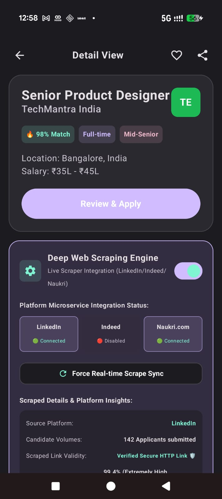
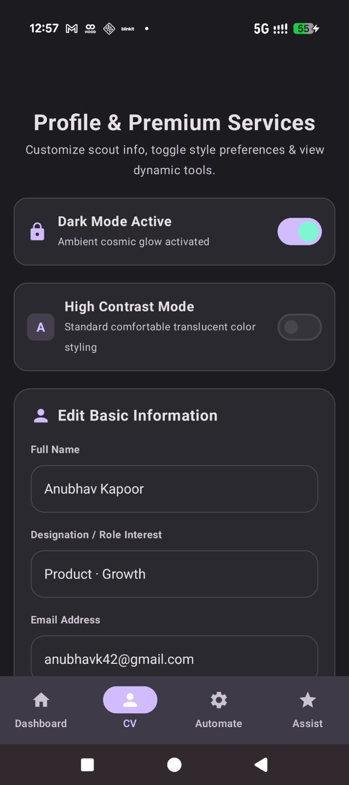
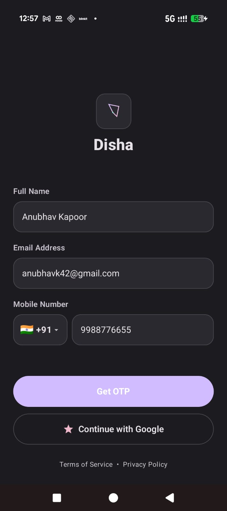
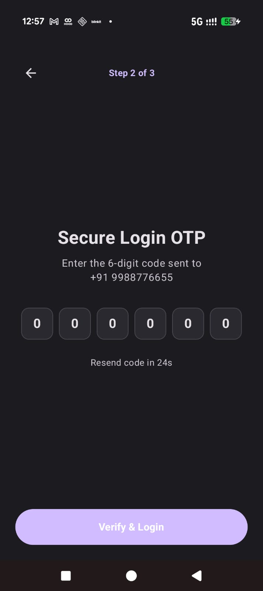
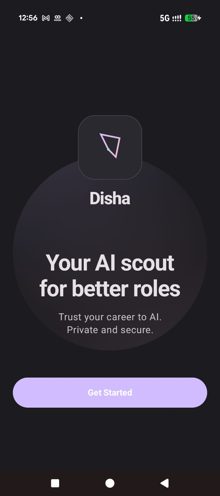
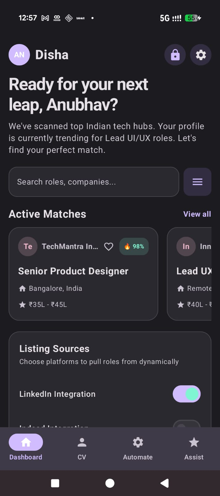

# Disha 🧭
**Your AI scout for better roles.**

AI-powered career matching app for India — matches your profile to jobs intelligently, automates applications, and helps you land better roles faster.

---

## 📱 Screenshots

  
  
  

  
  
  

---

## ✨ Features

- 🎯 **AI Job Matching** — 98% match scoring based on your profile
- 🤖 **Auto Apply** — Automate applications across LinkedIn, Indeed & Naukri
- 📄 **Magical Cover Letter** — AI-generated personalized cover letters
- 🔍 **Deep Web Scraping** — Live job listings from multiple platforms
- 💼 **CV Builder** — Professional resume PDF for ₹49
- 🔔 **Smart Notifications** — Job alerts and application updates
- 🔒 **Privacy First** — Your data never sold, always in your control

---

## 🛠️ Tech Stack

| Layer | Technology |
|-------|------------|
| Language | Kotlin |
| UI | Jetpack Compose |
| Backend | Firebase |
| Architecture | MVVM |
| Database | Room + DataStore |

---

## 🚀 Setup

Add your keys to `local.properties`:
---

## 👨‍💻 Built by

**Anubhav Kapoor** — B.Pharm + MBA (SPJIMR)
PM portfolio project exploring AI-first career tools for India.

---
*Disha — Built for India's next generation of job seekers*
